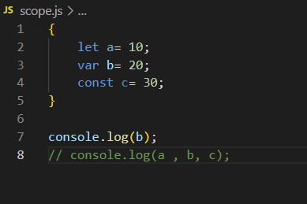
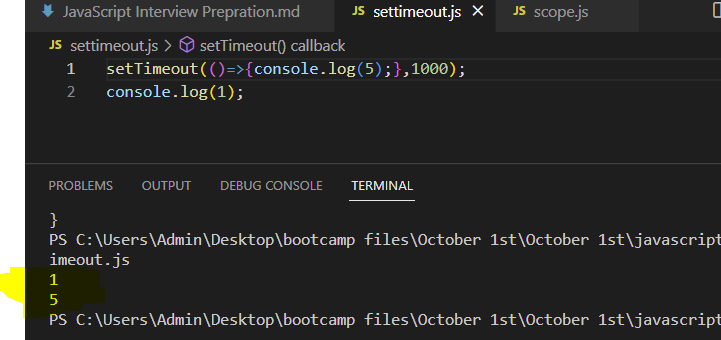
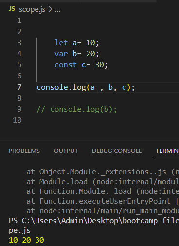
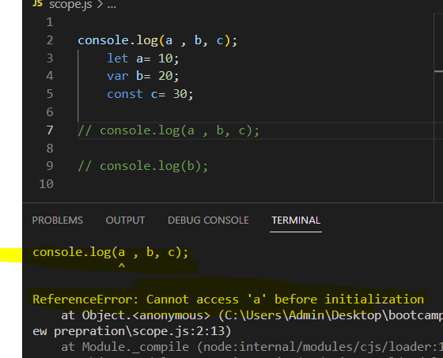

# JAVASCRIPT INTERVIEW PREPRATION

### What is nature of JavaScript?
> Javascript is Synchronus and Single threaded.
Synchronus meaning when first line finishes executing then second line starts to execute.
For example if incase there is an API that takes few seconds to repond we would prefer that our language should behave like asynchronous so that rest of program can execute while we wait for API's response.

### What are Function Scope and Block Scopes?
> Three scopes are there in JavaScript :
>* Global scope
>* Functinal scope
>* Block scope(introduced in ES6)  
>Up until now, you must have been using var to declare a variable in Javascript. Var has a global scope but with ES6 came two new ways of declaring variables: let and const  
Functional scopes means you can access the variables which are declared in a function inside the function only not outside that function.  
Block Scope means the Variable (let and const) is accessible within the Blocks {*this is block scope*}

output for this will be 20.
and if we want to access 'a' and 'c' outside the block we will get error that they *aren't defined*

### What is Synchronus and Asynchronus in Javascript?
> Javascript in Synchronus in nature.
Synchronus means in a sequence.In javascript when a line finishes executing after that only the next line executes.
To see asynchronus nature of Javascript we can use settimeout.
for example:
here we can see that javascript run the line 2 first then when the wait time of line 1 gets over then it gets executed. Therefore, the output is 1 5.

### Is Javascript a statically typed or Dynamically typed language?
>Javascript is a dynamically typed language as when we use a variable we don't need to specify it's type i.e it is int or string or anything else . But we can use statically typed language feature in javascript by using TYPESCRIPT which is superset of javascript .

### what is Hoisting?
>Hoisting can be easily understood by below example:

We can see that the variables are accessed after  they are declared by on the contrary ,if we try to access the variable before they are declared or initialized they it would throw an error (ReferenceError: Cannot access 'a' before initialization)

